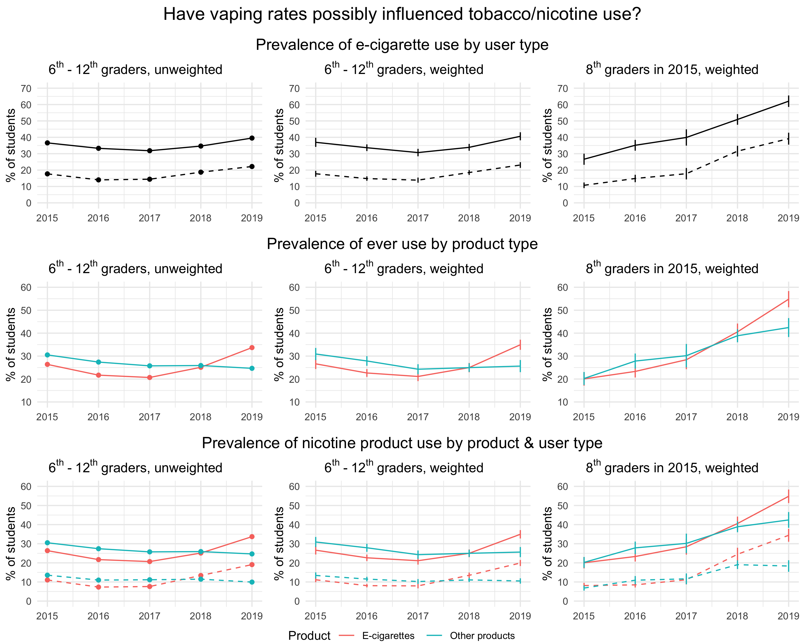

```{r, echo=FALSE}
knit_time_start <- Sys.time()
```

```{r, echo=FALSE}
knitr::opts_chunk$set(fig.width=10, fig.height=8, dpi=300) 
```



# Overview

Questions:

1. How has tobacco/nicotine use by American youth changed since 2015?
2. How do vaping rates compare between males and females?
3. What vaping brands and flavors appear to be used the most frequently?
    + During the past 30 days, what brand of e-cigarettes did you usually use?
4. Have vaping rates possibly influenced tobacco/nicotine use?

References:

- [Article in Frontiers of Pharmacology](https://www.frontiersin.org/articles/10.3389/fphar.2019.01619/full)

- [Morbidity and Mortality Weekly Report](https://www.cdc.gov/mmwr/volumes/68/wr/mm6806e1.htm?s_cid=mm6806e1_w)

- [Statista Visualization](https://www.statista.com/statistics/881837/vaping-and-electronic-cigarette-use-us-by-gender/)

# Motivation

## Background

## Analysis goal

## Learning objectives

Pooled Cross-sectional Data vs Panel Data *Ask Michael about this if unclear*

Survey weights

Data visualization

Working with codebooks

## Libraries

```{r}
library(tidyverse)
library(readxl)
library(srvyr)
library(cowplot)
```

# Data import

## Datasets

```{r, echo=FALSE, eval=FALSE}
tbl <- list.files(recursive = TRUE,
                  pattern = "*.xlsx") %>% 
  map(~read_excel(.))

tbl_names <- list.files(recursive = TRUE,
                        pattern = "*.xlsx") %>%
  str_extract("nyts[2][0][1][5-9]")

names(tbl) <- tbl_names

tbl[["nyts2015"]] <- tbl[["nyts2015"]] %>%
    dplyr::select(psu,
                  finwgt,
                  stratum,
                  Qn1, #Age
                  Qn2, #Sex
                  Qn3, #Grade
                  starts_with("Qn4"), #Hispanic/Latino
                  starts_with("Qn5"), #Race,
                  starts_with("E",
                              ignore.case = FALSE),
                  starts_with("C",
                              ignore.case = FALSE),
                  EFLAVCIGTS,
                  CFLAVCIGTS,
                  EFLAVCIGAR,
                  )

tbl[["nyts2016"]] <- tbl[["nyts2016"]] %>%
    dplyr::select(psu,
                  finwgt,
                  stratum,
                  Q1, #Age
                  Q2, #Sex
                  Q3, #Grade
                  starts_with("Q4"), #Hispanic/Latino
                  starts_with("Q5"), #Race
                  starts_with("E",
                              ignore.case = FALSE),
                  starts_with("C",
                              ignore.case = FALSE),
                  EFLAVCIGAR,
                  Q50A, #Menthol # What flavors of tobacco products have you used in the past 30 days? (Select one or more)
                  Q50B, #Clove or spice
                  Q50C, #Fruit
                  Q50D, #Chocolate
                  Q50E, #Alcoholic Drink
                  Q50F, #Candy/Desserts/Other Sweets
                  Q50G, #Some Other Flavor Not Listed Here
                  Q50H #I Did Not Use Flavored Tobacco Products In the Past
                  ) 

tbl[["nyts2017"]] <- tbl[["nyts2017"]] %>%
    dplyr::select(psu,
                  finwgt,
                  stratum,
                  Q1, #Age
                  Q2, #Sex
                  Q3, #Grade
                  starts_with("Q4"), #Hispanic/Latino
                  starts_with("Q5"), #Race
                  starts_with("E",
                              ignore.case = FALSE),
                  starts_with("C",
                              ignore.case = FALSE),
                  CBIDIS,
                  Q50A, #Menthol # What flavors of tobacco products have you used in the past 30 days? (Select one or more)
                  Q50B, #Clove or spice
                  Q50C, #Fruit
                  Q50D, #Chocolate
                  Q50E, #Alcoholic Drink
                  Q50F, #Candy/Desserts/Other Sweets
                  Q50G, #Some Other Flavor Not Listed Here
                  Q50H #I Did Not Use Flavored Tobacco Products In the Past
                  )

tbl[["nyts2018"]] <- tbl[["nyts2018"]] %>%
    dplyr::select(psu,
                  finwgt,
                  stratum,
                  Q1, #Age
                  Q2, #Sex
                  Q3, #Grade
                  starts_with("Q4"), #Hispanic/Latino
                  starts_with("Q5"), #Race
                  starts_with("E",
                              ignore.case = FALSE),
                  starts_with("C",
                              ignore.case = FALSE),
                  Q50A, #Menthol # What flavors of tobacco products have you used in the past 30 days? (Select one or more)
                  Q50B, #Clove or spice
                  Q50C, #Fruit
                  Q50D, #Chocolate
                  Q50E, #Alcoholic Drink
                  Q50F, #Candy/Desserts/Other Sweets
                  Q50G, #Some Other Flavor Not Listed Here
                  Q50H #I Did Not Use Flavored Tobacco Products In the Past
                  )

tbl[["nyts2019"]] <- tbl[["nyts2019"]] %>%
    dplyr::select(psu,
                  finwgt,
                  stratum,
                  Q1, #Age
                  Q2, #Sex
                  Q3, #Grade
                  starts_with("Q4"), #Hispanic/Latino
                  starts_with("Q5"), #Race
                  starts_with("E",
                              ignore.case = FALSE),
                  starts_with("C",
                              ignore.case = FALSE),
                  EHTP,
                  CHTP,
                  Q40, #Brang, e-cigarettes
                  Q62A, #Menthol # What flavors of tobacco products have you used in the past 30 days? (Select one or more)
                  Q62B, #Clove or spice
                  Q62C, #Fruit 
                  Q62D, #Chocolate
                  Q62E, #Alcoholic Drink
                  Q62F, #Candy/Desserts/Other Sweets
                  Q62G, #Some Other Flavor Not Listed Here 
                  )

dir.create("data_reduced",
           showWarnings = FALSE)

mapply(write_csv, tbl, path=paste0("data_reduced/",
                                   names(tbl),
                                   '.csv')
       )
```

```{r, echo=FALSE, include=FALSE}
start_time <- Sys.time()
csvs <- list.files(recursive = TRUE,
                   pattern = "*.csv") %>% 
  map(~read_csv(.))
end_time <- Sys.time()

test_time <- end_time - start_time

time_message <- paste("Duration of data import:",
      round(as.numeric(test_time) ,3),
      units(test_time)
      )

csvs_names <- list.files(recursive = TRUE,
                         pattern = "*.csv") %>%
  str_extract("nyts[2][0][1][5-9]")

names(csvs) <- csvs_names

nyts_data <- csvs
rm(csvs)
rm(csvs_names)
```

```{r, eval=FALSE}
nyts_data <- list.files(recursive = TRUE,
                   pattern = "*.xlsx") %>% 
  map(~read_excel(.))

nyts_data_names <- list.files(recursive = TRUE,
                         pattern = "*.xlsx") %>%
  str_extract("nyts[2][0][1][5-9]")

names(nyts_data) <- nyts_data_names

names(nyts_data)
```

# Data wrangling

```{r}
nyts_data[["nyts2015"]] <- nyts_data[["nyts2015"]] %>%
    dplyr::select(psu,
                  finwgt,
                  stratum,
                  Qn1, #Age
                  Qn2, #Sex
                  Qn3, #Grade
                  starts_with("Qn4"), #Hispanic/Latino
                  starts_with("Qn5"), #Race
                  starts_with("E",
                              ignore.case = FALSE),
                  starts_with("C",
                              ignore.case = FALSE),
                  -EFLAVCIGTS,
                  -CFLAVCIGTS,
                  -EFLAVCIGAR,
                  ) %>%
    rename(Age=Qn1,
           female=Qn2,
           Grade=Qn3,
           Not_HL=Qn4a,
           HL_Mex=Qn4b,
           HL_PR=Qn4c,
           HL_Cub=Qn4d,
           HL_Other=Qn4e,
           Race_AIAN=Qn5a,
           Race_Asian=Qn5b,
           Race_BAA=Qn5c,
           Race_NHOPI=Qn5d,
           Race_White=Qn5e) %>%
    mutate(Age=Age+8,
           Grade=Grade+5,
           brand_ecig=NA,
           menthol=NA,
           clove_spice=NA,
           fruit=NA,
           chocolate=NA,
           alcoholic_drink=NA,
           candy_dessert_sweets=NA,
           other=NA,
           no_use=NA) %>%
  dplyr::select(-starts_with("Q"))
```

```{r}
sapply(nyts_data[["nyts2015"]], function(x)
    summary(
        factor(x)
        )
    )
```

```{r}
#Note about difference between recode and fct_recode
nyts_data[["nyts2015"]] <- nyts_data[["nyts2015"]] %>%
  mutate_all(~ replace(., . %in% c("."), NA)) %>%
  mutate(Age=as.character(Age),
         Grade=as.character(Grade)
         ) %>%
  mutate(Age=recode(Age,
                    `19` = ">18",
                    ),
         female=recode(female,
                      `1`= FALSE,
                      `2` = TRUE,
                      .default = NA,
                      .missing = NA),
         Grade=recode(Grade,
                      `13` = "Ungraded/Other"),
         Not_HL=recode(Not_HL,
                       `1` = TRUE,
                       .default = FALSE,
                      .missing = FALSE)) %>%
  mutate_at(vars(starts_with("HL", ignore.case = FALSE)),
              list(~recode(.,
                       `1` = TRUE,
                       .default = FALSE,
                      .missing = FALSE))) %>%
  mutate_at(vars(starts_with("Race", ignore.case = FALSE)),
              list(~recode(.,
                       `1` = TRUE,
                       .default = FALSE,
                      .missing = FALSE))) %>%
  mutate_at(vars(starts_with("E", ignore.case = FALSE),
                   starts_with("C", ignore.case = FALSE)),
              list(~recode(.,
                           `1` = TRUE,
                           `2` = FALSE,
                           .default = NA,
                      .missing = NA)))
```

```{r}
sapply(nyts_data[["nyts2015"]], function(x)
    summary(
        factor(x)
        )
    )
```

```{r}
nyts_data[["nyts2016"]] <- nyts_data[["nyts2016"]] %>%
    dplyr::select(psu,
                  finwgt,
                  stratum,
                  Q1, #Age
                  Q2, #Sex
                  Q3, #Grade
                  starts_with("Q4"), #Hispanic/Latino
                  starts_with("Q5"), #Race
                  starts_with("E",
                              ignore.case = FALSE),
                  starts_with("C",
                              ignore.case = FALSE),
                  -EFLAVCIGAR,
                  Q50A, #Menthol # What flavors of tobacco products have you used in the past 30 days? (Select one or more)
                  Q50B, #Clove or spice
                  Q50C, #Fruit
                  Q50D, #Chocolate
                  Q50E, #Alcoholic Drink
                  Q50F, #Candy/Desserts/Other Sweets
                  Q50G, #Some Other Flavor Not Listed Here
                  Q50H #I Did Not Use Flavored Tobacco Products In the Past
                  ) %>%
    rename(Age=Q1,
           female=Q2,
           Grade=Q3,
           Not_HL=Q4A,
           HL_Mex=Q4B,
           HL_PR=Q4C,
           HL_Cub=Q4D,
           HL_Other=Q4E,
           Race_AIAN=Q5A,
           Race_Asian=Q5B,
           Race_BAA=Q5C,
           Race_NHOPI=Q5D,
           Race_White=Q5E,
           female=Q2,
           menthol=Q50A,
           clove_spice=Q50B,
           fruit=Q50C,
           chocolate=Q50D,
           alcoholic_drink=Q50E,
           candy_dessert_sweets=Q50F,
           other=Q50G,
           no_use=Q50H) %>%
    mutate(Age = as.numeric(Age) + 8,
           Grade = as.numeric(Grade) + 5,
           brand_ecig=NA) %>%
  dplyr::select(-starts_with("Q"))

sapply(nyts_data[["nyts2016"]], function(x)
    summary(
        factor(x)
        )
    )

nyts_data[["nyts2016"]] <- nyts_data[["nyts2016"]] %>%
  mutate_all(~ replace(., . %in% c("*", "**"), NA)) %>%
  mutate(Age=as.character(Age),
         Grade=as.character(Grade)
         ) %>%
  mutate(Age=recode(Age,
                    `19` = ">18",
                    ),
         female=recode(female,
                      `1`= FALSE,
                      `2` = TRUE,
                      .default = NA,
                      .missing = NA),
         Grade=recode(Grade,
                      `13` = "Ungraded/Other"),
         Not_HL=recode(Not_HL,
                       `1` = TRUE,
                       .default = FALSE,
                      .missing = FALSE)) %>%
  mutate_at(vars(starts_with("HL", ignore.case = FALSE)),
              list(~recode(.,
                       `1` = TRUE,
                       .default = FALSE,
                      .missing = FALSE))) %>%
  mutate_at(vars(starts_with("Race", ignore.case = FALSE)),
              list(~recode(.,
                       `1` = TRUE,
                       .default = FALSE,
                      .missing = FALSE))) %>%
    mutate_at(vars(starts_with("E", ignore.case = FALSE),
                   starts_with("C", ignore.case = FALSE)),
              list(~recode(.,
                           `1` = TRUE,
                           `2` = FALSE,
                       .default = FALSE,
                      .missing = FALSE))) %>%
    mutate_at(vars(menthol:no_use),
              list(~recode(.,
                           `1` = TRUE,
                       .default = FALSE,
                      .missing = FALSE)))

sapply(nyts_data[["nyts2016"]], function(x)
    summary(
        factor(x)
        )
    )
```

```{r}
nyts_data[["nyts2017"]] <- nyts_data[["nyts2017"]] %>%
    dplyr::select(psu,
                  finwgt,
                  stratum,
                  Q1, #Age
                  Q2, #Sex
                  Q3, #Grade
                  starts_with("Q4"), #Hispanic/Latino
                  starts_with("Q5"), #Race
                  starts_with("E",
                              ignore.case = FALSE),
                  starts_with("C",
                              ignore.case = FALSE),
                  CBIDIS,
                  Q50A, #Menthol # What flavors of tobacco products have you used in the past 30 days? (Select one or more)
                  Q50B, #Clove or spice
                  Q50C, #Fruit
                  Q50D, #Chocolate
                  Q50E, #Alcoholic Drink
                  Q50F, #Candy/Desserts/Other Sweets
                  Q50G, #Some Other Flavor Not Listed Here
                  Q50H #I Did Not Use Flavored Tobacco Products In the Past
                  ) %>%
    rename(Age=Q1,
           female=Q2,
           Grade=Q3,
           Not_HL=Q4A,
           HL_Mex=Q4B,
           HL_PR=Q4C,
           HL_Cub=Q4D,
           HL_Other=Q4E,
           Race_AIAN=Q5A,
           Race_Asian=Q5B,
           Race_BAA=Q5C,
           Race_NHOPI=Q5D,
           Race_White=Q5E,
           female=Q2,
           menthol=Q50A,
           clove_spice=Q50B,
           fruit=Q50C,
           chocolate=Q50D,
           alcoholic_drink=Q50E,
           candy_dessert_sweets=Q50F,
           other=Q50G,
           no_use=Q50H) %>%
    mutate(Age = as.numeric(Age) + 8,
           Grade = as.numeric(Grade) + 5,
           brand_ecig=NA) %>%
  dplyr::select(-starts_with("Q"))

sapply(nyts_data[["nyts2017"]], function(x)
    summary(
        factor(x)
        )
    )

nyts_data[["nyts2017"]] <- nyts_data[["nyts2017"]] %>%
  mutate_all(~ replace(., . %in% c("*", "**"), NA)) %>%
  mutate(Age=as.character(Age),
         Grade=as.character(Grade)
         ) %>%
  mutate(Age=recode(Age,
                    `19` = ">18",
                    ),
         female=recode(female,
                      `1`= FALSE,
                      `2` = TRUE,
                      .default = NA,
                      .missing = NA),
         Grade=recode(Grade,
                      `13` = "Ungraded/Other"),
         Not_HL=recode(Not_HL,
                       `1` = TRUE,
                       .default = FALSE,
                      .missing = FALSE)) %>%
  mutate_at(vars(starts_with("HL", ignore.case = FALSE)),
              list(~recode(.,
                       `1` = TRUE,
                       .default = FALSE,
                      .missing = FALSE))) %>%
  mutate_at(vars(starts_with("Race", ignore.case = FALSE)),
              list(~recode(.,
                       `1` = TRUE,
                       .default = FALSE,
                      .missing = FALSE))) %>%
    mutate_at(vars(starts_with("E", ignore.case = FALSE),
                   starts_with("C", ignore.case = FALSE)),
              list(~recode(.,
                           `1` = TRUE,
                           `2` = FALSE,
                       .default = FALSE,
                      .missing = FALSE))) %>%
    mutate_at(vars(menthol:no_use),
              list(~recode(.,
                           `1` = TRUE,
                       .default = FALSE,
                      .missing = FALSE)))

sapply(nyts_data[["nyts2017"]], function(x)
    summary(
        factor(x)
        )
    )
```

```{r}
nyts_data[["nyts2018"]] <- nyts_data[["nyts2018"]] %>%
    dplyr::select(psu,
                  finwgt,
                  stratum,
                  Q1, #Age
                  Q2, #Sex
                  Q3, #Grade
                  starts_with("Q4"), #Hispanic/Latino
                  starts_with("Q5"), #Race
                  starts_with("E",
                              ignore.case = FALSE),
                  starts_with("C",
                              ignore.case = FALSE),
                  Q50A, #Menthol # What flavors of tobacco products have you used in the past 30 days? (Select one or more)
                  Q50B, #Clove or spice
                  Q50C, #Fruit
                  Q50D, #Chocolate
                  Q50E, #Alcoholic Drink
                  Q50F, #Candy/Desserts/Other Sweets
                  Q50G, #Some Other Flavor Not Listed Here
                  Q50H #I Did Not Use Flavored Tobacco Products In the Past
                  ) %>%
    rename(Age=Q1,
           female=Q2,
           Grade=Q3,
           Not_HL=Q4A,
           HL_Mex=Q4B,
           HL_PR=Q4C,
           HL_Cub=Q4D,
           HL_Other=Q4E,
           Race_AIAN=Q5A,
           Race_Asian=Q5B,
           Race_BAA=Q5C,
           Race_NHOPI=Q5D,
           Race_White=Q5E,
           female=Q2,
           menthol=Q50A,
           clove_spice=Q50B,
           fruit=Q50C,
           chocolate=Q50D,
           alcoholic_drink=Q50E,
           candy_dessert_sweets=Q50F,
           other=Q50G,
           no_use=Q50H) %>%
    mutate(Age = as.numeric(Age) + 8,
           Grade = as.numeric(Grade) + 5,
           brand_ecig=NA) %>%
  dplyr::select(-starts_with("Q"))

sapply(nyts_data[["nyts2018"]], function(x)
    summary(
        factor(x)
        )
    )

nyts_data[["nyts2018"]] <- nyts_data[["nyts2018"]] %>%
  mutate_all(~ replace(., . %in% c("*", "**"), NA)) %>%
  mutate(Age=as.character(Age),
         Grade=as.character(Grade)
         ) %>%
    mutate(Age=recode(Age,
                    `19` = ">18",
                    ),
         female=recode(female,
                      `1`= FALSE,
                      `2` = TRUE,
                      .default = NA,
                      .missing = NA),
         Grade=recode(Grade,
                      `13` = "Ungraded/Other"),
         Not_HL=recode(Not_HL,
                       `1` = TRUE,
                       .default = FALSE,
                      .missing = FALSE)) %>%
  mutate_at(vars(starts_with("HL", ignore.case = FALSE)),
              list(~recode(.,
                       `1` = TRUE,
                       .default = FALSE,
                      .missing = FALSE))) %>%
  mutate_at(vars(starts_with("Race", ignore.case = FALSE)),
              list(~recode(.,
                       `1` = TRUE,
                       .default = FALSE,
                      .missing = FALSE))) %>%
  mutate_at(vars(starts_with("E", ignore.case = FALSE),
                   starts_with("C", ignore.case = FALSE)),
            list(~recode(.,
                         `1` = TRUE,
                         `2` = FALSE,
                         .missing = NA))) %>%
    mutate_at(vars(menthol:no_use),
              list(~recode(.,
                           `1` = TRUE,
                       .default = FALSE,
                      .missing = FALSE)))

sapply(nyts_data[["nyts2018"]], function(x)
    summary(
        factor(x)
        )
    )
```

```{r}
nyts_data[["nyts2019"]] <- nyts_data[["nyts2019"]] %>%
    dplyr::select(psu,
                  finwgt,
                  stratum,
                  Q1, #Age
                  Q2, #Sex
                  Q3, #Grade
                  starts_with("Q4"), #Hispanic/Latino
                  starts_with("Q5"), #Race
                  starts_with("E",
                              ignore.case = FALSE),
                  starts_with("C",
                              ignore.case = FALSE),
                  -EHTP,
                  -CHTP,
                  Q40, #Brang, e-cigarettes
                  Q62A, #Menthol # What flavors of tobacco products have you used in the past 30 days? (Select one or more)
                  Q62B, #Clove or spice
                  Q62C, #Fruit 
                  Q62D, #Chocolate
                  Q62E, #Alcoholic Drink
                  Q62F, #Candy/Desserts/Other Sweets
                  Q62G, #Some Other Flavor Not Listed Here 
                  )  %>%
    rename(brand_ecig=Q40,
           Age=Q1,
           female=Q2,
           Grade=Q3,
           Not_HL=Q4A,
           HL_Mex=Q4B,
           HL_PR=Q4C,
           HL_Cub=Q4D,
           HL_Other=Q4E,
           Race_AIAN=Q5A,
           Race_Asian=Q5B,
           Race_BAA=Q5C,
           Race_NHOPI=Q5D,
           Race_White=Q5E,
           female=Q2,
           menthol=Q62A,
           clove_spice=Q62B,
           fruit=Q62C,
           chocolate=Q62D,
           alcoholic_drink=Q62E,
           candy_dessert_sweets=Q62F,
           other=Q62G) %>%
    mutate(Age = as.numeric(Age) + 8,
           Grade = as.numeric(Grade) + 5,
           no_use="missing") %>%
  dplyr::select(-starts_with("Q"))

sapply(nyts_data[["nyts2019"]], function(x)
    summary(
        factor(x)
        )
    )

nyts_data[["nyts2019"]] <- nyts_data[["nyts2019"]] %>%
  mutate_all(~ replace(., . %in% c(".N",".S",".Z"), NA)) %>%
  mutate(Age=as.character(Age),
         Grade=as.character(Grade)
         ) %>%
  mutate(psu=as.character(psu),
         Age=recode(Age,
                    `19` = ">18",
                    ),
         female=recode(female,
                      `1`= FALSE,
                      `2` = TRUE,
                      .default = NA),
         Grade=recode(Grade,
                      `13` = "Ungraded/Other"),
         Not_HL=recode(Not_HL,
                       `1` = TRUE,
                       .default = FALSE,
                      .missing = FALSE)) %>%
  mutate_at(vars(starts_with("HL", ignore.case = FALSE)),
              list(~recode(.,
                       `1` = TRUE,
                       .default = FALSE,
                      .missing = FALSE))) %>%
  mutate_at(vars(starts_with("Race", ignore.case = FALSE)),
              list(~recode(.,
                       `1` = TRUE,
                       .default = FALSE,
                      .missing = FALSE))) %>%
    mutate_at(vars(starts_with("E", ignore.case = FALSE),
                   starts_with("C", ignore.case = FALSE)),
              list(~recode(.,
                           `1` = TRUE,
                           `2` = FALSE,
                           .default = NA))) %>%
    mutate(brand_ecig = recode(brand_ecig,
                                             `1` = "Other", #levels 1,8 combined to `Other` 
                                             `2` = "Blu",
                                             `3` = "JUUL",
                                             `4` = "Logic",
                                             `5` = "MarkTen",
                                             `6` = "NJOY",
                                             `7` = "Vuse",
                                             `8` = "Other")) %>%
    mutate_at(vars(menthol:no_use),
              list(~recode(.,
                           `1` = TRUE,
                           .default = FALSE,
                           .missing =FALSE))) #Ask Michael about this if unclear

sapply(nyts_data[["nyts2019"]], function(x)
    summary(
        factor(x)
        )
    )
```

```{r}
nyts_data <- nyts_data %>%
  map_df(bind_rows, .id = "year") %>%
  mutate(year=as.numeric(str_remove(year,"nyts")))

sapply(nyts_data, class)

sapply(nyts_data, function(x)
    summary(
        factor(x)
        )
    )
```

<style>
div.blue { background-color:#e6f0ff; border-radius: 5px; padding: 20px;}
</style>
<div class = "blue">

Reminder: Current users are a subset of ever users. 

</div>

# Data visualization

## Question 1 

```{r}
plot1 <- nyts_data %>%
    mutate(tobacco_sum_ever = select(., starts_with("E", ignore.case = FALSE)) %>%
               apply(1, sum, na.rm=TRUE),
           tobacco_sum_current = select(., starts_with("C", ignore.case = FALSE)) %>%
               apply(1, sum, na.rm=TRUE)) %>%
    mutate(tobacco_ever = case_when(tobacco_sum_ever > 0 ~ TRUE,
                                    tobacco_sum_ever ==0 ~ FALSE),
           tobacco_current = case_when(tobacco_sum_current > 0 ~ TRUE,
                                    tobacco_sum_current ==0 ~ FALSE)) %>%
    group_by(year) %>%
    summarise(tobacco_ever_year=(sum(tobacco_ever, na.rm = TRUE)*100)/
                sum(!is.na(tobacco_ever)),
              tobacco_current_year=(sum(tobacco_current, na.rm = TRUE)*100)/
                sum(!is.na(tobacco_current))) %>%
    rename("Ever"=tobacco_ever_year,
           "Current"=tobacco_current_year) %>%
    gather(key=User,
           value=`Percentage of students`,
           -year) %>%
    ggplot(aes(x=year,y=`Percentage of students`, linetype=User)) +
    geom_line() + 
  geom_point(show.legend = FALSE) +
  scale_linetype_manual(values = c(2,1)) +
    scale_y_continuous(breaks = seq(0,70,by=10),
                       labels = seq(0,70,by=10),
                       limits = c(0,70)) +
    theme_minimal() +
    theme(legend.position = "bottom",
          axis.title.x = element_blank()) +
    labs(title = "How does nicotine use vary over the years?",
         subtitle = "Current and ever users of nicotine products",
         y = "% of students")

plot1 
```

## Question 2

```{r}
plot2 <- nyts_data %>%
    group_by(year,
             female) %>%
    summarise(EELCIGT_year=(sum(EELCIGT, na.rm = TRUE)*100)/
                sum(!is.na(EELCIGT)),
              CELCIGT_year=(sum(CELCIGT, na.rm = TRUE)*100)/
                sum(!is.na(CELCIGT))) %>% 
    filter(!is.na(female)) %>%
    rename("E-cigarettes, Ever"=EELCIGT_year,
           "E-cigarettes, Current"=CELCIGT_year) %>%
    gather(key=Category,
           value=`Percentage of students`,
           -year,
           -female) %>%
    mutate(User = case_when(Category == "E-cigarettes, Ever" ~ "Ever",
                               Category == "E-cigarettes, Current" ~ "Current")) %>%
    mutate(Sex = case_when(female == TRUE ~ "Females",
                               female == FALSE ~ "Males")) %>%
    ggplot(aes(x=year,y=`Percentage of students`, color=Sex, linetype=User)) +
    geom_line() + 
  geom_point(show.legend = FALSE) +
  scale_linetype_manual(values = c(2,1)) +
    theme_minimal() +
    theme(legend.position = "bottom",
          axis.text.x = element_text(angle = 90),
          axis.title.x = element_blank()) +
    labs(title = "How do vaping rates compare between males and females?",
         subtitle = "Current and ever users by gender",
         y = "% of students")

plot2
```

## Question 3

What vaping brands and flavors appear to be used the most frequently?

```{r, echo=FALSE, fig.cap="Huang J, Duan Z, Kwok J, et al. Tob Control 2019;28:146–151.", out.width = '100%'}
knitr::include_graphics("HuangJ_DuanZ_KwokJ_et_al_TobaccoControl_Figure1.png")
```

[Paper](https://tobaccocontrol.bmj.com/content/tobaccocontrol/28/2/146.full.pdf)


```{r}
plot3 <- nyts_data %>%
    filter(year==2019) %>%
    group_by(brand_ecig) %>%
    filter(!is.na(brand_ecig)) %>%
    summarise(n = n()) %>%
    mutate(total = sum(n),
           Percent = n*100/total) %>%
    mutate(brand_ecig = fct_reorder(brand_ecig, desc(Percent))) %>%
    ggplot(aes(x=brand_ecig,y=Percent, fill=brand_ecig)) +
    geom_bar(stat="identity") +
    theme_minimal() +
    theme(legend.position = "none",
          axis.text.x = element_text(size=10),
          axis.title.x = element_blank()) +
    labs(title = "What vaping brands appear to be used the most frequently?",
         subtitle = "Brand of e-cigarette most frequently used in the last 30 days (2019)",
         y = "% of e-cigarette users responding")

plot3
```

```{r}
plot4 <- nyts_data %>%
  filter(year!=2015) %>%
  group_by(year) %>%
  summarise(Menthol=(sum(menthol, na.rm = TRUE)*100)/
                sum(!is.na(menthol)),
              `Clove or Spice`=(sum(clove_spice, na.rm = TRUE)*100)/
                sum(!is.na(clove_spice)),
              `Fruit`=(sum(fruit, na.rm = TRUE)*100)/
                sum(!is.na(fruit)),
              `Chocolate`=(sum(chocolate, na.rm = TRUE)*100)/
                sum(!is.na(chocolate)),
              `Alcoholic Drink`=(sum(alcoholic_drink, na.rm = TRUE)*100)/
                sum(!is.na(alcoholic_drink)),
              `Candy/Desserts/Sweets`=(sum(candy_dessert_sweets, na.rm = TRUE)*100)/sum(!is.na(candy_dessert_sweets))) %>%
  gather(key=Flavor,value=`Percentage of students`,-year) %>%
  ggplot(aes(x=year, y=`Percentage of students`, color=Flavor)) +
  geom_line() +
  geom_point(show.legend = FALSE) +
  theme_minimal() +
  theme(legend.position = "bottom",
          axis.text.x = element_text(angle = 90),
          axis.title.x = element_blank()) + 
  labs(title = "What flavors appear to be used the most frequently in nicotine products?",
       subtitle = "Flavors of tobacco products used in the past 30 days")

plot4 
```

```{r}
plot5 <- nyts_data %>%
  filter(year!=2015) %>%
  filter(menthol==TRUE|
           clove_spice==TRUE|
           fruit==TRUE|
           chocolate==TRUE|
           alcoholic_drink==TRUE|
           candy_dessert_sweets==TRUE|
           other==TRUE) %>%
  mutate(ecig_sum_ever = select(., EELCIGT) %>%
               apply(1, sum, na.rm=TRUE),
           ecig_sum_current = select(., CELCIGT) %>%
               apply(1, sum, na.rm=TRUE),
           non_ecig_sum_ever = select(., starts_with("E", ignore.case = FALSE)) %>%
               select(.,-EELCIGT) %>%
               apply(1, sum, na.rm=TRUE),
           non_ecig_sum_current = select(., starts_with("C", ignore.case = FALSE)) %>%
               select(.,-CELCIGT) %>%
               apply(1, sum, na.rm=TRUE)) %>%
    mutate(ecig_ever = case_when(ecig_sum_ever > 0 ~ TRUE,
                                    ecig_sum_ever ==0 ~ FALSE),
           ecig_current = case_when(ecig_sum_current > 0 ~ TRUE,
                                    ecig_sum_current ==0 ~ FALSE),
           non_ecig_ever = case_when(non_ecig_sum_ever > 0 ~ TRUE,
                                    non_ecig_sum_ever ==0 ~ FALSE),
           non_ecig_current = case_when(non_ecig_sum_current > 0 ~ TRUE,
                                    non_ecig_sum_current ==0 ~ FALSE)) %>%
  mutate(ecig_only_ever = case_when(ecig_ever == TRUE &
                                      non_ecig_ever ==FALSE ~ TRUE,
                                    TRUE ~ FALSE),
           ecig_only_current = case_when(ecig_current == TRUE &
                                           non_ecig_ever ==FALSE ~ TRUE,
                                    TRUE ~ FALSE),
           non_ecig_only_ever = case_when(non_ecig_ever == TRUE &
                                            ecig_ever ==FALSE ~ TRUE,
                                    TRUE ~ FALSE),
           non_ecig_only_current = case_when(non_ecig_current == TRUE &
                                               ecig_ever ==FALSE ~ TRUE,
                                    TRUE ~ FALSE)) %>%
  mutate(Group = case_when(ecig_only_ever==TRUE |
                             ecig_only_current==TRUE ~ "Only e-cigarettes",
                         non_ecig_only_ever==TRUE |
                           non_ecig_only_current==TRUE ~ "Only other products",
                                    TRUE ~ "Both")) %>%
  filter(Group!="Both") %>%
  group_by(year, Group) %>%
  summarise(`Menthol`=(sum(menthol, na.rm = TRUE)*100)/
              sum(!is.na(menthol)),
              `Clove or Spice`=(sum(clove_spice, na.rm = TRUE)*100)/
              sum(!is.na(clove_spice)),
              `Fruit`=(sum(fruit, na.rm = TRUE)*100)/sum(!is.na(fruit)),
              `Chocolate`=(sum(chocolate, na.rm = TRUE)*100)/
              sum(!is.na(chocolate)),
              `Alcoholic Drink`=(sum(alcoholic_drink, na.rm = TRUE)*100)/
              sum(!is.na(alcoholic_drink)),
              `Candy/Desserts/Sweets`=(sum(candy_dessert_sweets, na.rm = TRUE)*100)/
              sum(!is.na(candy_dessert_sweets)),
            `Other`=(sum(other, na.rm = TRUE)*100)/
              sum(!is.na(other)),
            Respondents=n()) %>%
  gather(key=Flavor,value=`Percentage of students`,-year, -Group, -Respondents) %>%
  filter(!is.na(`Percentage of students`),
         Flavor!="Other") %>%
  group_by(Flavor) %>%
  mutate(affirmative=(Respondents * `Percentage of students`)/100) %>%
  mutate(flavor_mean = sum(affirmative)/sum(Respondents)) %>%
  ungroup() %>%
  mutate(flavor_mean_rank = dense_rank(flavor_mean),
         Flavor = fct_reorder(Flavor, flavor_mean_rank)) %>%
  ggplot(aes(x=year, y=`Percentage of students`, color=Group)) +
  facet_wrap(.~Flavor,ncol=3) +
  geom_line() + 
  geom_point(show.legend = FALSE) + 
  theme_minimal() +
  theme(legend.position = "bottom",
          axis.title.x = element_blank(),
        axis.text.x = element_text(angle = 90)) + 
  labs(title = "Among users of only one type of product, what vaping flavors appear to be used the most frequently?",
       subtitle = "Percent reporting only e-cigarette use vs only other nicotine product use")

plot5
```

## Question 4

Have vaping rates possibly influenced tobacco/nicotine use?

```{r}
plot6 <- nyts_data %>%
    group_by(year) %>%
    summarise(ECIGT_year=(sum(ECIGT, na.rm = TRUE)*100)/
                sum(!is.na(ECIGT)),
              EELCIGT_year=(sum(EELCIGT, na.rm = TRUE)*100)/
                sum(!is.na(EELCIGT)),
              CCIGT_year=(sum(CCIGT, na.rm = TRUE)*100)/
                sum(!is.na(CCIGT)),
              CELCIGT_year=(sum(CELCIGT, na.rm = TRUE)*100)/
                sum(!is.na(CELCIGT))) %>%
    rename("Cigarettes, Ever"=ECIGT_year,
           "E-cigarettes, Ever"=EELCIGT_year,
           "Cigarettes, Current"=CCIGT_year,
           "E-cigarettes, Current"=CELCIGT_year) %>%
    gather(key=Category,
           value=`Percentage of students`,
           -year) %>%
    mutate(User = case_when(Category == "Cigarettes, Ever" ~ "Ever",
                               Category == "E-cigarettes, Ever" ~ "Ever",
                               Category == "Cigarettes, Current" ~ "Current",
                               Category == "E-cigarettes, Current" ~ "Current")) %>%
    mutate(Product = case_when(Category == "Cigarettes, Ever" ~ "Cigarettes",
                               Category == "E-cigarettes, Ever" ~ "E-cigarettes",
                               Category == "Cigarettes, Current" ~ "Cigarettes",
                               Category == "E-cigarettes, Current" ~ "E-cigarettes")) %>%
    ggplot(aes(x=year,y=`Percentage of students`, color=Product, linetype=User)) +
    geom_line() + 
  geom_point(show.legend = FALSE) +
  scale_linetype_manual(values = c(2,1)) +
    theme_minimal() +
    theme(legend.position = "bottom",
          axis.title.x = element_blank()) +
    labs(title = "How does e-cigarette use compare to cigarette use?",
         subtitle = "Current and ever users of e-cigarettes and cigarettes",
         y = "% of students")

plot6
```

```{r}
plot7 <- nyts_data %>%
    mutate(ecig_sum_ever = select(., EELCIGT) %>%
               apply(1, sum, na.rm=TRUE),
           ecig_sum_current = select(., CELCIGT) %>%
               apply(1, sum, na.rm=TRUE),
           non_ecig_sum_ever = select(., starts_with("E", ignore.case = FALSE)) %>%
               select(.,-EELCIGT) %>%
               apply(1, sum, na.rm=TRUE),
           non_ecig_sum_current = select(., starts_with("C", ignore.case = FALSE)) %>%
               select(.,-CELCIGT) %>%
               apply(1, sum, na.rm=TRUE)) %>%
    mutate(ecig_ever = case_when(ecig_sum_ever > 0 ~ TRUE,
                                    ecig_sum_ever ==0 ~ FALSE),
           ecig_current = case_when(ecig_sum_current > 0 ~ TRUE,
                                    ecig_sum_current ==0 ~ FALSE),
           non_ecig_ever = case_when(non_ecig_sum_ever > 0 ~ TRUE,
                                    non_ecig_sum_ever ==0 ~ FALSE),
           non_ecig_current = case_when(non_ecig_sum_current > 0 ~ TRUE,
                                    non_ecig_sum_current ==0 ~ FALSE)) %>%
    group_by(year) %>%
    summarise(ecig_ever_year=(sum(ecig_ever, na.rm = TRUE)*100)/
                sum(!is.na(ecig_ever)),
              ecig_current_year=(sum(ecig_current, na.rm = TRUE)*100)/
                sum(!is.na(ecig_current)),
              non_ecig_ever_year=(sum(non_ecig_ever, na.rm = TRUE)*100)/
                sum(!is.na(non_ecig_ever)),
              non_ecig_current_year=(sum(non_ecig_current, na.rm = TRUE)*100)/
                sum(!is.na(non_ecig_current))) %>%
    gather(key=Category,
           value=`Percentage of students`,
           -year)  %>%
    mutate(User = case_when(Category =="ecig_ever_year" ~ "Ever",
                           Category =="non_ecig_ever_year" ~ "Ever",
                           Category =="ecig_current_year" ~ "Current",
                           Category =="non_ecig_current_year" ~ "Current")) %>%
    mutate(Product = case_when(Category =="ecig_ever_year" ~ "E-cigarettes",
                           Category =="non_ecig_ever_year" ~ "Other products",
                           Category =="ecig_current_year" ~ "E-cigarettes",
                           Category =="non_ecig_current_year" ~ "Other products")) %>%
    filter(User=="Ever") %>%
    ggplot(aes(x=year,y=`Percentage of students`, color=Product)) +
    geom_line(linetype=1) + # geom_bar(stat="identity", position = "dodge", color="black") +
  geom_point(show.legend = FALSE) +
  scale_y_continuous(breaks = seq(10, 60, by = 10), limits = c(10,60)) +
    theme_minimal() +
    theme(legend.position = "bottom",
          axis.title.x = element_blank()) +
    labs(title = "How does e-cigarette ever use compare to ever use of other products over the years?",
         subtitle = "E-cigarette and non-e-cigarette use",
         y = "% of students")

plot7
```

```{r}
plot8 <- nyts_data %>%
    mutate(ecig_sum_ever = select(., EELCIGT) %>%
               apply(1, sum, na.rm=TRUE),
           ecig_sum_current = select(., CELCIGT) %>%
               apply(1, sum, na.rm=TRUE),
           non_ecig_sum_ever = select(., starts_with("E", ignore.case = FALSE)) %>%
               select(.,-EELCIGT) %>%
               apply(1, sum, na.rm=TRUE),
           non_ecig_sum_current = select(., starts_with("C", ignore.case = FALSE)) %>%
               select(.,-CELCIGT) %>%
               apply(1, sum, na.rm=TRUE)) %>%
    mutate(ecig_ever = case_when(ecig_sum_ever > 0 ~ TRUE,
                                    ecig_sum_ever ==0 ~ FALSE),
           ecig_current = case_when(ecig_sum_current > 0 ~ TRUE,
                                    ecig_sum_current ==0 ~ FALSE),
           non_ecig_ever = case_when(non_ecig_sum_ever > 0 ~ TRUE,
                                    non_ecig_sum_ever ==0 ~ FALSE),
           non_ecig_current = case_when(non_ecig_sum_current > 0 ~ TRUE,
                                    non_ecig_sum_current ==0 ~ FALSE)) %>%
    group_by(year) %>%
    summarise(ecig_ever_year=(sum(ecig_ever, na.rm = TRUE)*100)/
                sum(!is.na(ecig_ever)),
              ecig_current_year=(sum(ecig_current, na.rm = TRUE)*100)/
                sum(!is.na(ecig_current)),
              non_ecig_ever_year=(sum(non_ecig_ever, na.rm = TRUE)*100)/
                sum(!is.na(non_ecig_ever)),
              non_ecig_current_year=(sum(non_ecig_current, na.rm = TRUE)*100)/
                sum(!is.na(non_ecig_current))) %>%
    gather(key=Category,
           value=`Percentage of students`,
           -year) %>%
    mutate(User = case_when(Category =="ecig_ever_year" ~ "Ever",
                           Category =="non_ecig_ever_year" ~ "Ever",
                           Category =="ecig_current_year" ~ "Current",
                           Category =="non_ecig_current_year" ~ "Current")) %>%
    mutate(Product = case_when(Category =="ecig_ever_year" ~ "E-cigarettes",
                           Category =="non_ecig_ever_year" ~ "Other products",
                           Category =="ecig_current_year" ~ "E-cigarettes",
                           Category =="non_ecig_current_year" ~ "Other products")) %>%
    ggplot(aes(x=year,y=`Percentage of students`, color=Product, linetype=User)) +
    geom_line() +
  geom_point(show.legend = FALSE) +
  scale_linetype_manual(values = c(2,1)) +
  scale_y_continuous(breaks = seq(0, 60, by = 10), limits = c(0,60)) +
    theme_minimal() +
    theme(legend.position = "bottom",
          axis.title.x = element_blank()) +
    labs(title = "How does e-cigarette use compare to use of other products over the years?",
         subtitle = "E-cigarette and non-e-cigarette use",
         y = "% of students")

plot8
```

### Unweighted Sample

```{r, fig.height=10}
plotA_uw <- plot1 +
  theme(axis.title.x = element_blank(),
        legend.position = "none") +
    labs(title = "Nicotine product users more prevalent after 2017",
         subtitle = NULL,
         y = "% of students")

plotB_uw <- plot7 + 
  theme(axis.title.x = element_blank(),
        legend.position = "none") +
    labs(title = "% Ever trying e-cigarettes increases &\n% ever trying other products decreases",
         subtitle = NULL,
         y = "% of students")

plotC_uw <- plot8 + 
  theme(axis.title.x = element_blank(),
        legend.position = "none") +
    labs(title = "% Using e-cigarettes increases &\n% using Other products decreases",
         subtitle = NULL,
         y = "% of students")

title_uw <- ggdraw() + 
  draw_label(
    "Have vaping rates possibly influenced tobacco/nicotine use?",
    fontface = 'bold',
    size=14,
    x = 0,
    hjust = 0
  ) +
  theme(
    plot.margin = margin(0, 0, 0, 0)
  )

plotsA_uw <- plot_grid(plotA_uw,
                     rel_widths = c(1,1))
plotsBC_uw <- plot_grid(plotB_uw,
                        plotC_uw,
                        rel_widths = c(1,1))

legend_uw <- get_legend(plotB_uw +
                       theme(legend.position = "bottom",
                             legend.direction = "horizontal"))

figure_uw <- plot_grid(title_uw,
                       plotsA_uw,
                       plotsBC_uw,
                       legend_uw,
                       ncol = 1,
                       rel_heights = c(0.1,
                                       1,
                                       1,
                                       0.1),
                       scale = 1.0)

figure_uw
```

### Weighted Sample

```{r}
plotA_w <- nyts_data %>%
    mutate(tobacco_sum_ever = select(., starts_with("E", ignore.case = FALSE)) %>%
               apply(1, sum, na.rm=TRUE),
           tobacco_sum_current = select(., starts_with("C", ignore.case = FALSE)) %>%
               apply(1, sum, na.rm=TRUE)) %>%
    mutate(tobacco_ever = case_when(tobacco_sum_ever > 0 ~ TRUE,
                                    tobacco_sum_ever ==0 ~ FALSE),
           tobacco_current = case_when(tobacco_sum_current > 0 ~ TRUE,
                                    tobacco_sum_current ==0 ~ FALSE)) %>%
  as_survey_design(strata = stratum, ids = psu, weight  = finwgt, nest=TRUE) %>%
    group_by(year) %>%
  summarise(tobacco_ever_year = survey_mean(tobacco_ever, vartype = "ci", na.rm=TRUE),
            tobacco_current_year = survey_mean(tobacco_current, vartype = "ci", na.rm=TRUE))  %>%
  mutate_at(vars(-year), "*", 100) %>%
    gather(key=Type,
           value=`Percentage of students`,
           -year) %>%
  mutate(Estimate = case_when(grepl("_low", Type) ~ "Lower",
                          grepl("_upp", Type) ~ "Upper",
                          TRUE ~ "Mean"),
         User = case_when(grepl("ever", Type) ~ "Ever",
                          grepl("current", Type) ~ "Current",
                          TRUE ~ "Mean")) %>%
  dplyr::select(-Type) %>%
  spread(Estimate, `Percentage of students`) %>%
  ggplot(aes(x=year,y=Mean)) +
  geom_line(aes(linetype=User)) +
  geom_linerange(aes(ymin = Lower, ymax = Upper), show.legend = FALSE) +
  scale_linetype_manual(values = c(2,1)) +
    scale_y_continuous(breaks = seq(0,70,by=10),
                       labels = seq(0,70,by=10),
                       limits = c(0,70)) +
    theme_minimal() +
    theme(legend.position = "none",
          axis.title.x = element_blank()) +
    labs(title = "Nicotine product users more prevalent after 2017",
         y = "% of students")

plotB_w <- nyts_data %>%
    mutate(ecig_sum_ever = select(., EELCIGT) %>%
               apply(1, sum, na.rm=TRUE),
           ecig_sum_current = select(., CELCIGT) %>%
               apply(1, sum, na.rm=TRUE),
           non_ecig_sum_ever = select(., starts_with("E", ignore.case = FALSE)) %>%
               select(.,-EELCIGT) %>%
               apply(1, sum, na.rm=TRUE),
           non_ecig_sum_current = select(., starts_with("C", ignore.case = FALSE)) %>%
               select(.,-CELCIGT) %>%
               apply(1, sum, na.rm=TRUE)) %>%
    mutate(ecig_ever = case_when(ecig_sum_ever > 0 ~ TRUE,
                                    ecig_sum_ever ==0 ~ FALSE),
           ecig_current = case_when(ecig_sum_current > 0 ~ TRUE,
                                    ecig_sum_current ==0 ~ FALSE),
           non_ecig_ever = case_when(non_ecig_sum_ever > 0 ~ TRUE,
                                    non_ecig_sum_ever ==0 ~ FALSE),
           non_ecig_current = case_when(non_ecig_sum_current > 0 ~ TRUE,
                                    non_ecig_sum_current ==0 ~ FALSE)) %>%
  as_survey_design(strata = stratum, ids = psu, weight  = finwgt, nest=TRUE) %>%
    group_by(year) %>%
    summarise(ecig_ever_year = survey_mean(ecig_ever, vartype = "ci", na.rm=TRUE),
            ecig_current_year = survey_mean(ecig_current, vartype = "ci", na.rm=TRUE),
            non_ecig_ever_year = survey_mean(non_ecig_ever, vartype = "ci", na.rm=TRUE),
            non_ecig_current_year = survey_mean(non_ecig_current, vartype = "ci", na.rm=TRUE)) %>%
  mutate_at(vars(-year), "*", 100) %>%
  dplyr::select(year,
                ecig_ever_year,
                ecig_current_year,
                non_ecig_ever_year,
                non_ecig_current_year,
                contains("low"),
                contains("upp")) %>%
    gather(key=Category,
           value=`Percentage of students`,
           -year)  %>%
  mutate(Estimate = case_when(grepl("_low", Category) ~ "Lower",
                          grepl("_upp", Category) ~ "Upper",
                          TRUE ~ "Mean"),
         User = case_when(grepl("current", Category) ~ "Current",
                          TRUE ~ "Ever",),
         Product = case_when(grepl("non_ecig", Category) ~ "Other products",
                          TRUE ~ "E-cigarettes")) %>%
  dplyr::select(-Category) %>%
  spread(Estimate, `Percentage of students`) %>%
  filter(User=="Ever") %>%
  dplyr::rename("Lower_temp" = Upper,
                "Upper_temp" = Lower) %>%
  dplyr::rename("Lower"=Lower_temp,
                "Upper"=Upper_temp) %>%
    ggplot(aes(x=year,y=Mean, color=Product)) +
  geom_line(linetype=1) +
  geom_linerange(aes(ymin = Lower, ymax = Upper), show.legend = FALSE) +
  scale_y_continuous(breaks = seq(10, 60, by = 10), limits = c(10,60)) +
    theme_minimal() +
    theme(legend.position = "none",
          axis.title.x = element_blank()) +
    labs(title = "% ever trying e-cigarettes increases &\n% ever trying other products decreases",
         y = "% of students")

plotC_w <- nyts_data %>%
    mutate(ecig_sum_ever = select(., EELCIGT) %>%
               apply(1, sum, na.rm=TRUE),
           ecig_sum_current = select(., CELCIGT) %>%
               apply(1, sum, na.rm=TRUE),
           non_ecig_sum_ever = select(., starts_with("E", ignore.case = FALSE)) %>%
               select(.,-EELCIGT) %>%
               apply(1, sum, na.rm=TRUE),
           non_ecig_sum_current = select(., starts_with("C", ignore.case = FALSE)) %>%
               select(.,-CELCIGT) %>%
               apply(1, sum, na.rm=TRUE)) %>%
    mutate(ecig_ever = case_when(ecig_sum_ever > 0 ~ TRUE,
                                    ecig_sum_ever ==0 ~ FALSE),
           ecig_current = case_when(ecig_sum_current > 0 ~ TRUE,
                                    ecig_sum_current ==0 ~ FALSE),
           non_ecig_ever = case_when(non_ecig_sum_ever > 0 ~ TRUE,
                                    non_ecig_sum_ever ==0 ~ FALSE),
           non_ecig_current = case_when(non_ecig_sum_current > 0 ~ TRUE,
                                    non_ecig_sum_current ==0 ~ FALSE)) %>%
  as_survey_design(strata = stratum, ids = psu, weight  = finwgt, nest=TRUE) %>%
    group_by(year) %>%
  summarise(ecig_ever_year = survey_mean(ecig_ever, vartype = "ci", na.rm=TRUE),
            ecig_current_year = survey_mean(ecig_current, vartype = "ci", na.rm=TRUE),
            non_ecig_ever_year = survey_mean(non_ecig_ever, vartype = "ci", na.rm=TRUE),
            non_ecig_current_year = survey_mean(non_ecig_current, vartype = "ci", na.rm=TRUE)) %>%
  mutate_at(vars(-year), "*", 100) %>%
  dplyr::select(year,
                ecig_ever_year,
                ecig_current_year,
                non_ecig_ever_year,
                non_ecig_current_year,
                contains("low"),
                contains("upp")) %>%
    gather(key=Category,
           value=`Percentage of students`,
           -year) %>%
    mutate(Estimate = case_when(grepl("_low", Category) ~ "Lower",
                          grepl("_upp", Category) ~ "Upper",
                          TRUE ~ "Mean"),
         User = case_when(grepl("ever", Category) ~ "Ever",
                          grepl("current", Category) ~ "Current"),
         Product = case_when(grepl("non_ecig", Category) ~ "Other products",
                          TRUE ~ "E-cigarettes")) %>%
  dplyr::select(-Category) %>%
  spread(Estimate, `Percentage of students`) %>%
    ggplot(aes(x=year,y=Mean, color=Product)) +
  geom_line(aes(linetype=User)) +
  geom_linerange(aes(ymin = Lower, ymax = Upper), show.legend = FALSE) +
  scale_linetype_manual(values = c(2,1)) +
  scale_y_continuous(breaks = seq(0, 60, by = 10), limits = c(0,60)) +
    theme_minimal() +
    theme(legend.position = "none",
          axis.title.x = element_blank()) +
    labs(title = "% Using e-cigarettes increases &\n% using Other products decreases",
         y = "% of students")

title_w <- ggdraw() + 
  draw_label(
    expression("Have vaping rates possibly influenced tobacco/nicotine use?"),
    fontface = 'bold',
    size=14,
    x = 0,
    hjust = 0
  ) +
  theme(
    plot.margin = margin(0, 0, 0, 0)
  )

plotsA_w <- plot_grid(plotA_w,
                     rel_widths = c(1),
                     align = "v",
                     axis = "bt")
plotsBC_w <- plot_grid(plotB_w,
                     plotC_w,
                     rel_widths = c(1,1),
                     align = "v",
                     axis = "bt")

legend_w <- get_legend(plotB_w +
                       theme(legend.position = "bottom",
                             legend.direction = "horizontal"))

figure_w <- plot_grid(title_w,
                      plotsA_w,
                      plotsBC_w,
                      legend_w,
                      ncol = 1,
                      rel_heights = c(0.1,
                                      1,
                                      1,
                                      0.1),
                      scale = 1.0)

figure_w
```

### Hypothethical Cohort

```{r}
plotA_w_8 <- nyts_data %>%
  filter((Grade == "8" & year == 2015) |
         (Grade == "9" & year == 2016) |
         (Grade == "10" & year == 2017) |
         (Grade == "11" & year == 2018) |
          (Grade == "12" & year == 2019) 
         ) %>%
    mutate(tobacco_sum_ever = select(., starts_with("E", ignore.case = FALSE)) %>%
               apply(1, sum, na.rm=TRUE),
           tobacco_sum_current = select(., starts_with("C", ignore.case = FALSE)) %>%
               apply(1, sum, na.rm=TRUE)) %>%
    mutate(tobacco_ever = case_when(tobacco_sum_ever > 0 ~ TRUE,
                                    tobacco_sum_ever ==0 ~ FALSE),
           tobacco_current = case_when(tobacco_sum_current > 0 ~ TRUE,
                                    tobacco_sum_current ==0 ~ FALSE)) %>%
  as_survey_design(strata = stratum, ids = psu, weight  = finwgt) %>%
    group_by(year) %>%
  summarise(tobacco_ever_year = survey_mean(tobacco_ever, vartype = "ci", na.rm=TRUE),
            tobacco_current_year = survey_mean(tobacco_current, vartype = "ci", na.rm=TRUE))  %>%
  mutate_at(vars(-year), "*", 100) %>%
    gather(key=Type,
           value=`Percentage of students`,
           -year) %>%
  mutate(Estimate = case_when(grepl("_low", Type) ~ "Lower",
                          grepl("_upp", Type) ~ "Upper",
                          TRUE ~ "Mean"),
         User = case_when(grepl("ever", Type) ~ "Ever",
                          grepl("current", Type) ~ "Current",
                          TRUE ~ "Mean")) %>%
  dplyr::select(-Type) %>%
  spread(Estimate, `Percentage of students`) %>%
  ggplot(aes(x=year,y=Mean)) +
  geom_line(aes(linetype=User)) +
  geom_linerange(aes(ymin = Lower, ymax = Upper)) + 
  scale_linetype_manual(values = c(2,1)) +
    scale_y_continuous(breaks = seq(0,70,by=10),
                       labels = seq(0,70,by=10),
                       limits = c(0,70)) +
    theme_minimal() +
    theme(legend.position = "none",
          axis.title.x = element_blank()) +
    labs(title = "Nicotine product users becoming increasingly prevalent",
         y = "% of students")

plotB_w_8 <- nyts_data %>%
  filter((Grade == "8" & year == 2015) |
         (Grade == "9" & year == 2016) |
         (Grade == "10" & year == 2017) |
         (Grade == "11" & year == 2018) |
          (Grade == "12" & year == 2019) 
         ) %>%
    mutate(ecig_sum_ever = select(., EELCIGT) %>%
               apply(1, sum, na.rm=TRUE),
           ecig_sum_current = select(., CELCIGT) %>%
               apply(1, sum, na.rm=TRUE),
           non_ecig_sum_ever = select(., starts_with("E", ignore.case = FALSE)) %>%
               select(.,-EELCIGT) %>%
               apply(1, sum, na.rm=TRUE),
           non_ecig_sum_current = select(., starts_with("C", ignore.case = FALSE)) %>%
               select(.,-CELCIGT) %>%
               apply(1, sum, na.rm=TRUE)) %>%
    mutate(ecig_ever = case_when(ecig_sum_ever > 0 ~ TRUE,
                                    ecig_sum_ever ==0 ~ FALSE),
           ecig_current = case_when(ecig_sum_current > 0 ~ TRUE,
                                    ecig_sum_current ==0 ~ FALSE),
           non_ecig_ever = case_when(non_ecig_sum_ever > 0 ~ TRUE,
                                    non_ecig_sum_ever ==0 ~ FALSE),
           non_ecig_current = case_when(non_ecig_sum_current > 0 ~ TRUE,
                                    non_ecig_sum_current ==0 ~ FALSE)) %>%
  as_survey_design(strata = stratum, ids = psu, weight  = finwgt) %>%
    group_by(year) %>%
    summarise(ecig_ever_year = survey_mean(ecig_ever, vartype = "ci", na.rm=TRUE),
            ecig_current_year = survey_mean(ecig_current, vartype = "ci", na.rm=TRUE),
            non_ecig_ever_year = survey_mean(non_ecig_ever, vartype = "ci", na.rm=TRUE),
            non_ecig_current_year = survey_mean(non_ecig_current, vartype = "ci", na.rm=TRUE)) %>%
  mutate_at(vars(-year), "*", 100) %>%
  dplyr::select(year,
                ecig_ever_year,
                ecig_current_year,
                non_ecig_ever_year,
                non_ecig_current_year,
                contains("low"),
                contains("upp")) %>%
    gather(key=Category,
           value=`Percentage of students`,
           -year)  %>%
  mutate(Estimate = case_when(grepl("_low", Category) ~ "Lower",
                          grepl("_upp", Category) ~ "Upper",
                          TRUE ~ "Mean"),
         User = case_when(grepl("current", Category) ~ "Current",
                          TRUE ~ "Ever",),
         Product = case_when(grepl("non_ecig", Category) ~ "Other products",
                          TRUE ~ "E-cigarettes")) %>%
  dplyr::select(-Category) %>%
  spread(Estimate, `Percentage of students`) %>%
  filter(User=="Ever") %>%
  dplyr::rename("Lower_temp" = Upper,
                "Upper_temp" = Lower) %>%
  dplyr::rename("Lower"=Lower_temp,
                "Upper"=Upper_temp) %>%
  ggplot(aes(x=year,y=Mean, color=Product)) +
  geom_line(linetype=1) +
  geom_linerange(aes(ymin = Lower, ymax = Upper)) + 
  scale_y_continuous(breaks = seq(10, 60, by = 10), limits = c(10,60)) +
    theme_minimal() +
    theme(legend.position = "none",
          axis.title.x = element_blank()) +
    labs(title = "% ever trying nicotine products increases",
         y = "% of students")

plotC_w_8 <- nyts_data %>%
  filter((Grade == "8" & year == 2015) |
         (Grade == "9" & year == 2016) |
         (Grade == "10" & year == 2017) |
         (Grade == "11" & year == 2018) |
          (Grade == "12" & year == 2019) 
         ) %>%
    mutate(ecig_sum_ever = select(., EELCIGT) %>%
               apply(1, sum, na.rm=TRUE),
           ecig_sum_current = select(., CELCIGT) %>%
               apply(1, sum, na.rm=TRUE),
           non_ecig_sum_ever = select(., starts_with("E", ignore.case = FALSE)) %>%
               select(.,-EELCIGT) %>%
               apply(1, sum, na.rm=TRUE),
           non_ecig_sum_current = select(., starts_with("C", ignore.case = FALSE)) %>%
               select(.,-CELCIGT) %>%
               apply(1, sum, na.rm=TRUE)) %>%
    mutate(ecig_ever = case_when(ecig_sum_ever > 0 ~ TRUE,
                                    ecig_sum_ever ==0 ~ FALSE),
           ecig_current = case_when(ecig_sum_current > 0 ~ TRUE,
                                    ecig_sum_current ==0 ~ FALSE),
           non_ecig_ever = case_when(non_ecig_sum_ever > 0 ~ TRUE,
                                    non_ecig_sum_ever ==0 ~ FALSE),
           non_ecig_current = case_when(non_ecig_sum_current > 0 ~ TRUE,
                                    non_ecig_sum_current ==0 ~ FALSE)) %>%
  as_survey_design(strata = stratum, ids = psu, weight  = finwgt) %>%
    group_by(year) %>%
  summarise(ecig_ever_year = survey_mean(ecig_ever, vartype = "ci", na.rm=TRUE),
            ecig_current_year = survey_mean(ecig_current, vartype = "ci", na.rm=TRUE),
            non_ecig_ever_year = survey_mean(non_ecig_ever, vartype = "ci", na.rm=TRUE),
            non_ecig_current_year = survey_mean(non_ecig_current, vartype = "ci", na.rm=TRUE)) %>%
  mutate_at(vars(-year), "*", 100) %>%
  dplyr::select(year,
                ecig_ever_year,
                ecig_current_year,
                non_ecig_ever_year,
                non_ecig_current_year,
                contains("low"),
                contains("upp")) %>%
    gather(key=Category,
           value=`Percentage of students`,
           -year) %>%
    mutate(Estimate = case_when(grepl("_low", Category) ~ "Lower",
                          grepl("_upp", Category) ~ "Upper",
                          TRUE ~ "Mean"),
         User = case_when(grepl("ever", Category) ~ "Ever",
                          grepl("current", Category) ~ "Current"),
         Product = case_when(grepl("non_ecig", Category) ~ "Other products",
                          TRUE ~ "E-cigarettes")) %>%
  dplyr::select(-Category) %>%
  spread(Estimate, `Percentage of students`) %>%
    ggplot(aes(x=year,y=Mean, color=Product)) +
  geom_line(aes(linetype=User)) +
  geom_linerange(aes(ymin = Lower, ymax = Upper)) + 
  scale_linetype_manual(values = c(2,1)) +
  scale_y_continuous(breaks = seq(0, 60, by = 10), limits = c(0,60)) +
    theme_minimal() +
    theme(legend.position = "none",
          axis.title.x = element_blank()) +
    labs(title = "E-cigarette use surpasses use of other nicotine products",
         y = "% of students")

title_w_8 <- ggdraw() + 
  draw_label(
    expression("Among"~8^th~"graders in 2015, have vaping rates possibly influenced tobacco/nicotine use?"),
    fontface = 'bold',
    size=14,
    x = 0,
    hjust = 0
  ) +
  theme(
    plot.margin = margin(0, 0, 0, 0)
  )

plotsA_w_8 <- plot_grid(plotA_w_8,
                        rel_widths = c(1),
                        align = "v",
                        axis = "bt")

plotsBC_w_8 <- plot_grid(plotB_w_8,
                         plotC_w_8,
                         rel_widths = c(1,1),
                         axis = "bt")

legend_w_8 <- get_legend(plotB_w_8 +
                       theme(legend.position = "bottom",
                             legend.direction = "horizontal"))

figure_w_8 <- plot_grid(title_w_8,
                        plotsA_w_8,
                        plotsBC_w_8,
                        legend_w_8,
                        ncol = 1,
                        rel_heights = c(0.1,
                                      1,
                                      1,
                                      0.1),
                        scale = 1.0
)

figure_w_8
```

### Final Figure

```{r}
title_final <- ggdraw() +
  draw_label(
    expression("Have vaping rates possibly influenced tobacco/nicotine use?"),
    fontface = 'bold',
    size=16,
    x = 0.5) +
  theme(
    plot.margin = margin(0, 0, 0, 0)
  )

subtitle_uw_final <- ggdraw() + 
  draw_label(
    expression(~6^th~"-"~12^th~"graders, unweighted"),
    size=12,
    x = 0.5) +
  theme(
    plot.margin = margin(0, 0, 0, 0)
  )

subtitle_w_final <- ggdraw() + 
  draw_label(
    expression(~6^th~"-"~12^th~"graders, weighted"),
    fontface = 'bold',
    size=12,
    x = 0.5) +
  theme(
    plot.margin = margin(0, 0, 0, 0)
  )

subtitle_w_8_final <- ggdraw() + 
  draw_label(
    expression(~8^th~"graders in 2015, weighted"),
    fontface = 'bold',
    size=12,
    x = 0.5) +
  theme(
    plot.margin = margin(0, 0, 0, 0)
  )

subtitle_final <- plot_grid(subtitle_uw_final,
                            subtitle_w_final,
                            subtitle_w_8_final,
                            ncol = 3)

plotsA_title_final <- ggdraw() + 
  draw_label(
    expression("Prevalence of e-cigarette use by user type"),
    size=14,
    x = 0.5) +
  theme(
    plot.margin = margin(0, 0, 0, 0)
  )

plotsA_final <- plot_grid(plotA_uw + theme(plot.title = element_blank()),
                          plotA_w + theme(plot.title = element_blank()),
                          plotA_w_8 + theme(plot.title = element_blank()),
                          ncol = 3,
                          align = "v",
                          axis = "bt")

plotsB_title_final <- ggdraw() + 
  draw_label(
    expression("Prevalence of ever use by product type"),
    size=14,
    x = 0.5) +
  theme(
    plot.margin = margin(0, 0, 0, 0)
  )

plotsB_final <- plot_grid(plotB_uw + theme(plot.title = element_blank()),
                          plotB_w + theme(plot.title = element_blank()),
                          plotB_w_8 + theme(plot.title = element_blank()),
                          ncol = 3,
                          align = "v",
                          axis = "bt")

plotsC_title_final <- ggdraw() + 
  draw_label(
    expression("Prevalence of nicotine product use by product & user type"),
    size=14,
    x = 0.5) +
  theme(
    plot.margin = margin(0, 0, 0, 0)
  )

plotsC_final <- plot_grid(plotC_uw + theme(plot.title = element_blank()),
                          plotC_w + theme(plot.title = element_blank()),
                          plotC_w_8 + theme(plot.title = element_blank()),
                          ncol = 3,
                          align = "v",
                          axis = "bt")

legend_final <- get_legend(plotB_w +
                             theme(legend.position = "bottom",
                             legend.direction = "horizontal"))

final_plot <- plot_grid(title_final,
          plotsA_title_final,
          subtitle_final,
          plotsA_final,
          plotsB_title_final,
          subtitle_final,
          plotsB_final,
          plotsC_title_final,
          subtitle_final,
          plotsC_final,
          legend_final,
          ncol = 1,
          rel_heights = c(0.2,
                          0.2,
                          0.1,
                          1,
                          0.2,
                          0.1,
                          1,
                          0.2,
                          0.1,
                          1,
                          0.1))

final_plot
```

```{r, echo=FALSE, include=FALSE}
ggsave("final_plot.png")
```

# Homework questions

<style>
div.blue { background-color:#e6f0ff; border-radius: 5px; padding: 20px;}
</style>
<div class = "blue">

+ Apply survey weights to one of the figures produced in this case study in which weighted estimates were not produced. Include error bars in the updated figure.
    + Does the figure change after the application of survey weights?
    + If so, describe how. 
+ Reproduce `final_plot` above for a different cohort of your choice.

</div>

# Notes

Ever and current variables are limited to those shared by all years of data included in this case study.

```{r, echo=FALSE}
knit_time_end <- Sys.time()
```

```{r, echo=FALSE}
knit_time <- knit_time_end - knit_time_start
knit_time_message <- paste("Knit time:",
      round(as.numeric(knit_time) ,3),
      units(knit_time)
      )
```

<p style="color:red">New code: `r knit_time_message`. Previous code: ~ 3 m. </p>

# Problems

I had difficulty producing a plot that succinctly presented a trend. It's very easy to produce plots that are very useful once one is familiar with the data. Some plots, however, cannot stand alone and need additional context to be clear for those without prior knowledge of the data. When I first shared a plot I had been working on with others, it became clear that in my effort to present a complicated idea briefly I had left out information that would make the trend easily interpretable. To solve this issue, I began to present visualizations of the data alongside my original plot. The final figure I created contained several additional plots, each presenting the same trend at a different level than my initial plot.

My "centerpiece" plot is the middle plot in `final_plot`. The 8 plots around it help provide a very clear picture of what is going on in the US with regards to e-cigarette use and nicotine product use at large. On its own, it's difficult to understand the trends in the US and how important the weighting scheme is for inference. Once you add the left and right columns, it's clear what is going on. 